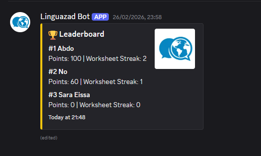
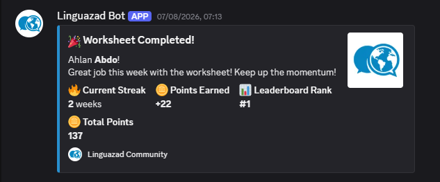
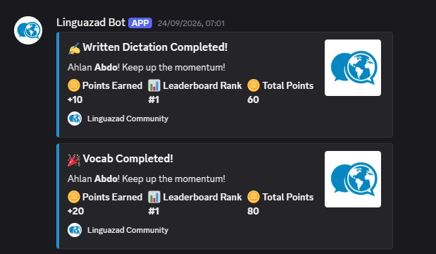
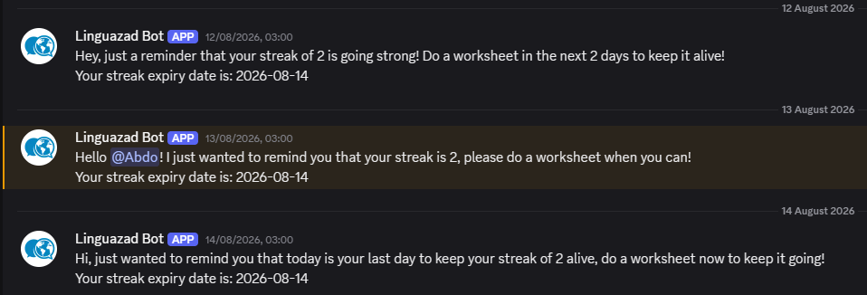
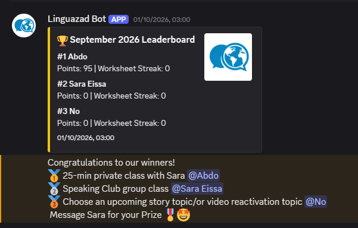

# LinguaBot

LinguaBot is a Discord bot I made to help increase activity in the [Linguazad community](https://linguazad.com/). It tracks points and adds some friendly competition to make learning feel more like a game.

It has streaks for weekly tasks, sort of like Duolingo, but weekly instead of daily. I wanted people to have a reason to keep coming back without feeling like they have to show up every single day. I think a daily streak could end up being demotivating.

The goal is to help members stay active and make the learning experience better. It's just been deployed, so I'm still waiting to see how much it helps with retention.

## What it does

- Awards points for writing, speaking, dictation, questions, and task submissions.
- Tracks weekly task streaks and gives bonus points for keeping them going.
- Shows leaderboards and gives roles to the monthly winners.
- Sends points updates and reminders when a streak is about to expire.
- Lets admins adjust points and streaks, or manually award a submission.

## Screenshots

### Leaderboard

Members can see their points, weekly streaks, and where they stand.



### Weekly task reward

Completing a task earns points and helps keep the weekly streak going. Streak bonuses increase the reward.



### Points notifications

Members get a DM showing what they earned, their total points, and their leaderboard rank.



### Streak reminders

The bot sends reminders when a streak is close to expiring.



### Monthly winners

At the end of the month, the bot announces the winners. These are the prizes we use in Linguazad.



## Commands

These commands require Discord Administrator permission. Members earn points through their learning activities without needing to run commands.

| Command | What it does |
| --- | --- |
| `.setserver` | Sets the current server as the bot's server. Restart afterward to sync slash commands to it. |
| `/configure` | Sets the two admins and the channels used for activities, leaderboards, and logs. |
| `/cfg` | Shows the saved server configuration. |
| `/leaderboard` | Refreshes the leaderboard. |
| `/add_points` | Adds points to a user and sends them a reward DM when the amount is positive. |
| `/remove_points` | Removes points from a user. |
| `/set_streak` | Sets a user's streak to the number you choose. |
| `/reset_date` | Resets a user's saved writing, speaking, or worksheet activity date. |
| `/award_submission` | Manually checks and rewards a submission using its message link and activity type. |

## Running your own copy

You can run your own copy. I built it for Linguazad, so you'll need to set it up for your server, but you don't have to build everything from scratch.

### 1. Get the code

Clone this repository, open its folder, and install the dependencies:

```sh
pip install -r requirements.txt
```

### 2. Set up Discord and Firebase

Create a Discord bot in the Discord Developer Portal. Enable the Server Members, Presence, and Message Content intents. Invite it to your server with the `bot` and `applications.commands` scopes. Give it access to the channels it will use, including permission to send messages, embed links, read message history, and add reactions. For winner roles, it also needs Manage Roles, with its role above the winner roles.

Create a Firebase project, enable Firestore, and generate a service account key. Create a `.env` file in the project folder:

```dotenv
DISCORD_TOKEN=your_discord_bot_token
FIREBASE_CREDS='paste the full service account JSON here on one line'
BOT_ENV=dev
```

Replace the `FIREBASE_CREDS` placeholder with the entire service account JSON on one line. Keep your `.env` file and service account key private.

`BOT_ENV` defaults to `dev`. Set it to `prod` to use separate Firestore collections with a `prod_` prefix.

### 3. Add your server settings

In Firestore, create a document called `settings` in the `config` collection. If you're using `BOT_ENV=prod`, use `prod_config` instead.

Add these fields before starting the bot:

- `server_id`: your Discord server ID.
- `text_points_emoji`, `voice_points_emoji`, and `vip_question_emoji`: the emojis used for those rewards.
- `worksheet_points_emojis`: an array of five emojis, ordered for rewards from 20 to 28 points.
- `winner_roles`: an array of three role IDs, ordered first, second, then third.
- `task_forum_ids`: a map with `worksheet`, `reactivation`, `vocab`, `retell`, and `connect`, each containing its forum channel ID.

You can copy server, channel, and role IDs by enabling Developer Mode in Discord. The `load_config` function in `main.py` lists the settings the bot uses.

### 4. Start the bot

```sh
python main.py
```

As a server admin, use `/configure` to select the admins and channels. If you haven't set `server_id` in Firestore, use `.setserver` first and restart the bot so its commands sync to your server.

Some messages and learning activities are specific to Linguazad. You can change those in `main.py` to fit your own community.
